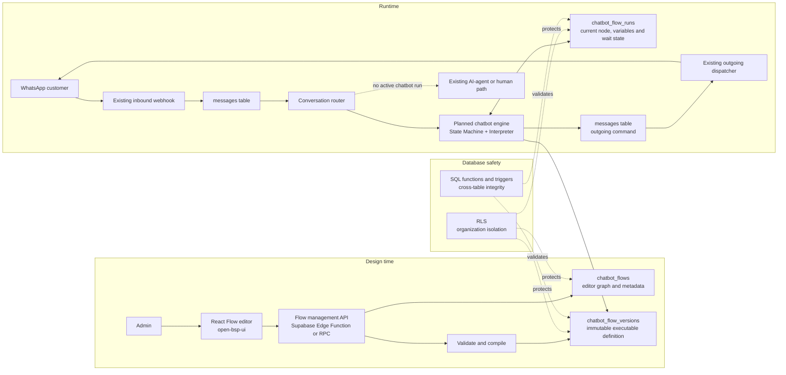
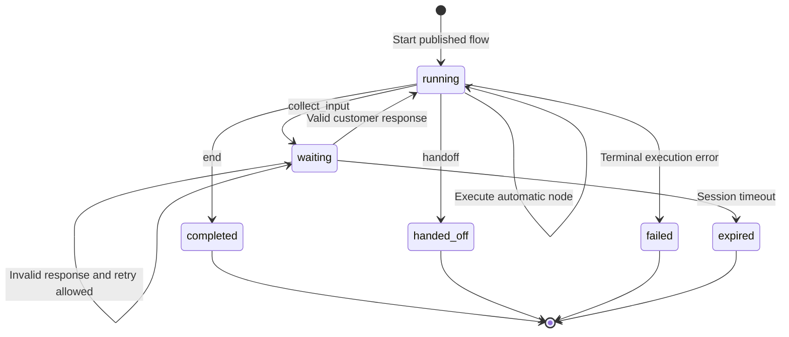
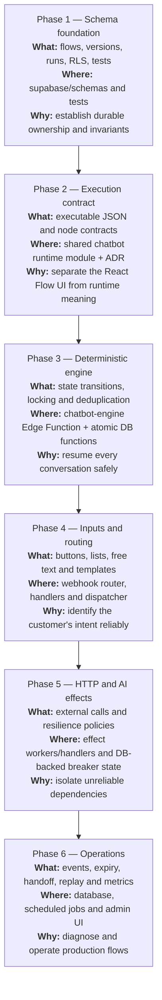

# Chatbot flow development

- **Status:** Phases 1 and 2 complete; Phase 3 planned
- **Last updated:** 2026-07-23
- **Jira:** SCRUM-52, SCRUM-53, SCRUM-54, SCRUM-55, SCRUM-56

## Purpose

This document records how the chatbot builder and execution engine should be
developed, where each responsibility belongs, and why the architecture uses
particular design patterns.

React Flow is the visual editor. It is not the runtime engine. The frontend
graph must be converted into a validated, versioned executable definition before
a chatbot can run it.

## Current position

The first schema draft exists in the following files:

- [`chatbot_flows` and versions/runs](../supabase/schemas/03_models/03-14_chatbot_flows.sql)
- [Database functions and integrity triggers](../supabase/schemas/04_functions_post_tables/04-08_chatbot_flows.sql)
- [Row-level security policies](../supabase/schemas/05_rls/05-14_chatbot_flows_rls.sql)
- [Database tests](../supabase/tests/chatbot_flows.sql)

The schema foundation was generated as
[`20260721200322_chatbot_flows.sql`](../supabase/migrations/20260721200322_chatbot_flows.sql),
applied to local Supabase, and verified with all 27 database tests. Backend
database types include the three chatbot tables. The shared Phase 2 module now
contains the version 1 executable contracts and editor-graph compiler. No
runtime execution engine exists yet.

## Architecture at a glance



## Core design decisions

| Concern              | Pattern or decision                       | Why                                                                                     |
| -------------------- | ----------------------------------------- | --------------------------------------------------------------------------------------- |
| Flow progress        | Database-backed **State Machine**         | A run has explicit states and valid transitions instead of scattered `if` statements.   |
| Published definition | **Interpreter**                           | The engine reads a versioned definition without generating or executing arbitrary code. |
| Node behavior        | **Strategy handlers**                     | Each node type has a small, testable handler with the same contract.                    |
| WhatsApp/API actions | **Command and outbox**                    | Runtime decisions are persisted before external side effects are dispatched.            |
| Remote failures      | **Timeout, retry and Circuit Breaker**    | Unhealthy APIs cannot repeatedly block every chatbot run.                               |
| Concurrent messages  | Transaction, row lock and idempotency key | Duplicate or simultaneous webhooks cannot advance a run twice.                          |
| Editing a live flow  | Immutable published versions              | Existing runs stay pinned to the definition with which they started.                    |
| Customer choice      | Stable option IDs                         | Routing does not break when a visible button label is translated or edited.             |
| Dynamic content      | Safe variable interpolation               | Templates can use known variables without permitting arbitrary JavaScript.              |

`chatbot_flow_runs` is both the runtime state and the MVP session record. A
separate session table should only be added later if one customer session must
coordinate multiple flows or channels.

## Runtime state lifecycle



The engine persists the current node, status, variables, pinned flow version,
last processed inbound message, and timestamps needed for expiry. This lets a
new Edge Function invocation resume the conversation even though Edge Functions
are stateless.

## Development roadmap: what, where and why



| Phase                           | What is decided or built                                                                                                 | Where it belongs                                                                                    | Why now                                                                                | Exit criteria                                                                                             |
| ------------------------------- | ------------------------------------------------------------------------------------------------------------------------ | --------------------------------------------------------------------------------------------------- | -------------------------------------------------------------------------------------- | --------------------------------------------------------------------------------------------------------- |
| 1. Schema foundation            | Flow metadata, immutable versions, runtime runs, integrity functions, RLS and tests                                      | `supabase/schemas/03_models`, `04_functions_post_tables`, `05_rls`, and `supabase/tests`            | Every later component needs a reliable persistence contract                            | Migration applies locally, database tests pass, and generated types are refreshed                         |
| 2. Execution contract           | Executable definition, node schemas, transition results, validation and compilation rules                                | Architecture decision record and a shared chatbot runtime module under `supabase/functions/_shared` | Prevents the editor's React Flow shape from becoming an accidental runtime API         | An example flow compiles; invalid graphs fail with useful errors; node contracts are unit tested          |
| 3. Deterministic engine         | Run creation/resume, row locking, inbound deduplication, transition loop and outgoing command creation                   | Planned `supabase/functions/chatbot-engine` plus small atomic database functions                    | Establishes correct execution before adding complex node types                         | A start-to-end text/input flow resumes across requests and cannot process one message twice               |
| 4. Inputs and routing           | Stable button/list IDs, free-text validation, safe templates, interactive outgoing messages and chatbot-first routing    | Inbound webhook/router, node strategies and existing outgoing dispatcher                            | Makes customer choices deterministic and prevents both chatbot and agent from replying | Buttons, lists and free text select the correct edge; fallback occurs only with no active run             |
| 5. HTTP and AI effects          | Secret references, request mapping, URL restrictions, timeouts, bounded retries, circuit breaker and success/error edges | Effect handlers or workers; durable retry/breaker data in Postgres                                  | Remote work is inherently slow and unreliable and must not corrupt run state           | Failure scenarios are tested; retries are bounded; open circuits fail fast; secrets never enter the graph |
| 6. Operations and observability | Run events, expiry, human handoff, failure inspection, replay/debug tools and metrics                                    | `chatbot_flow_run_events`, scheduled processing and admin UI                                        | Production support requires a history explaining every transition                      | Operators can answer what happened, why it happened, and what action is safe next                         |

## Phase 1 — Finish the schema foundation

The schema files are the source of truth. Do not create the same objects
manually in the Supabase dashboard and do not hand-write an ordinary migration.

Complete this phase in order:

1. Start local Supabase.
2. Generate the migration with `npx supabase db diff -f chatbot_flows`.
3. Apply it with `npx supabase migration up --local`.
4. Run `npx supabase test db --local supabase/tests/chatbot_flows.sql`.
5. Regenerate `supabase/functions/_shared/db_types.ts`.
6. Review the diff and commit the complete schema slice.

## Phase 2 — Define the execution contract

The runtime choice is recorded in
[ADR 0003](decisions/0003-chatbot-flow-execution-contract.md). The contract
defines only these MVP node types:

- `start`
- `send_message`
- `collect_input`
- `condition`
- `end`

The persisted editor graph may contain positions, colors, labels and collapsed
panels. The executable definition must contain only validated runtime data and
stable node/edge IDs.

The implementation lives in the shared
[`_shared/chatbot`](../supabase/functions/_shared/chatbot) module. Its compiler
returns either the stripped `FlowDefinitionV1` or deterministic, structured
issues that the editor can display.

Each strategy handler should return data rather than directly calling WhatsApp
or mutating several tables:

```ts
type NodeResult =
  | { type: "advance"; route: Route; variable_updates?: Variables }
  | { type: "wait_for_input"; prompt: string; expectation: InputExpectation }
  | { type: "emit_message"; message: TextMessage; route: DefaultRoute }
  | { type: "complete" }
  | { type: "fail"; code: string; message: string };
```

The engine interprets this result, persists the transition, and emits any
outgoing command through a single controlled path. Effect requests are added
with HTTP and AI nodes in Phase 5 rather than included in the MVP contract.

## Phase 3 — Build the deterministic engine

For each inbound message, the engine should:

1. Resolve the organization, contact and active published flow.
2. Load or create a run pinned to one flow version.
3. Lock the run row inside a short database transaction.
4. Ignore an inbound message already recorded as processed.
5. Validate the response expected by the current node.
6. Execute automatic nodes until reaching an input or terminal node.
7. Persist the new state and outgoing message commands atomically.
8. Release the lock before performing remote network work.

Set a maximum number of automatic transitions per invocation. This protects the
engine from malformed cycles.

## Phase 4 — Determine choices and render dynamic content

Visible labels are content; stable IDs are routing keys. For example:

```json
{
  "prompt": "How can we help?",
  "options": [
    {
      "id": "track_order",
      "label": "Track my order",
      "nextNodeId": "lookup-order"
    },
    {
      "id": "speak_to_agent",
      "label": "Talk to a person",
      "nextNodeId": "handoff"
    }
  ],
  "freeText": { "allowed": true, "fallbackNodeId": "describe-problem" }
}
```

WhatsApp reply payloads should carry `track_order`, not the label. For free
text, `collect_input` defines validation, normalization, maximum retries and a
fallback edge.

Dynamic messages should use a deliberately small template grammar such as
`Hello {{contact.name}}`. Resolve only allow-listed variables, escape output for
the destination, define behavior for missing values, and never evaluate code
stored in a flow.

## Phase 5 — Add external HTTP and AI effects safely

An HTTP or AI node produces an effect command. The effect handler performs the
remote call and sends the normalized result back to the engine through a success
or error transition.

Required safeguards:

- store credential references, never secret values, in the flow definition;
- restrict protocols, hosts, redirects, response size and execution time;
- use bounded retries with backoff only for retryable failures;
- make effect commands idempotent where the provider supports it;
- keep circuit-breaker state in Postgres or another shared store, not memory;
- define explicit success, timeout, rejected and failure edges;
- map response fields into allow-listed run variables.

Do not hold a database row lock while waiting for a third-party API.

## Phase 6 — Make the runtime operable

Add `chatbot_flow_run_events` when the engine is ready to emit meaningful
events. It should capture transitions, accepted/rejected inputs, effect
attempts, outgoing commands and terminal reasons without storing unnecessary
personal data or secrets.

Operational capabilities should include:

- expiring runs that wait too long for customer input;
- handing a run to a human without sending competing automated replies;
- inspecting failed runs and their last safe state;
- replaying definitions in a test/simulation mode without contacting customers;
- measuring completion, abandonment, node failure and remote-effect latency.

## Non-negotiable runtime invariants

- A run is permanently pinned to one published flow version.
- One inbound message advances a run at most once.
- Only one actor owns the response path: chatbot, AI agent or human.
- Published executable definitions are immutable.
- Node and option IDs are stable and are never derived from display labels.
- Arbitrary JavaScript, SQL and untrusted template expressions are forbidden.
- External calls happen outside the short transaction that advances run state.
- Organization isolation is enforced in the database as well as application
  code.
- Every terminal state has an explicit reason.

## Deliberately deferred

Do not add these before the MVP engine proves the core lifecycle:

- arbitrary plugin or custom-code nodes;
- nested reusable subflows;
- parallel branches and joins;
- distributed circuit-breaker tuning UI;
- full event sourcing as the primary state model;
- a separate session table without a demonstrated multi-flow requirement.

## Supporting references

- [Supabase Edge Functions](https://supabase.com/docs/guides/functions)
- [Supabase Edge Function architecture](https://supabase.com/docs/guides/functions/architecture)
- [PostgreSQL explicit locking](https://www.postgresql.org/docs/current/explicit-locking.html)
- [AWS circuit breaker pattern](https://docs.aws.amazon.com/prescriptive-guidance/latest/cloud-design-patterns/circuit-breaker.html)
- [Statecharts: A Visual Formalism for Complex Systems](https://www.state-machine.com/doc/Harel87.pdf)
