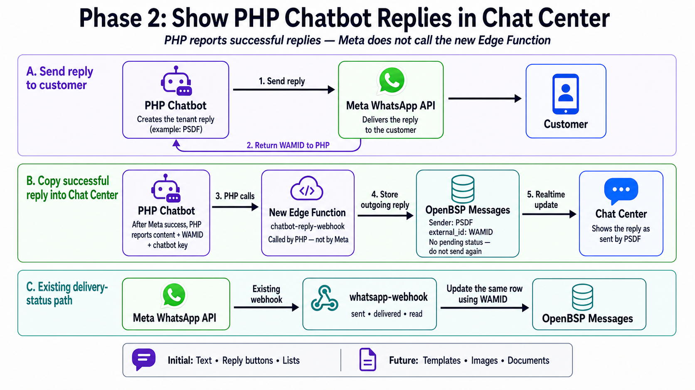

# PHP chatbot reply sync

This integration copies replies already accepted by the Meta WhatsApp API into
OpenBSP Chat Center. It does **not** send a WhatsApp message.



## Required sequence

1. The PHP chatbot sends one reply to the Meta WhatsApp API.
2. Meta accepts the send and returns the reply's WAMID.
3. PHP calls `chatbot-reply-webhook` once with that WAMID, the accepted reply,
   and the time it was accepted.
4. OpenBSP stores the outgoing reply under the tenant chatbot sender, such as
   `PSDF`.
5. Existing Meta `sent`, `delivered`, and `read` webhooks continue to call
   `whatsapp-webhook`. OpenBSP uses the WAMID to update the same message row.
6. Supabase Realtime sends the insert and later status updates to Chat Center.

Do not call this endpoint before Meta accepts the send. Do not call Meta from
this endpoint.

## Endpoint and authentication

```http
POST https://<SUPABASE_PROJECT_REF>.supabase.co/functions/v1/chatbot-reply-webhook
Authorization: Bearer <OPENBSP_API_KEY>
Content-Type: application/json
```

Use an OpenBSP API key belonging to the organization that owns
`phone_number_id`. The `organization_id` is resolved from the API key and must
not be supplied in the payload.

## Common fields

| Field             | Required | Meaning                                                                        |
| ----------------- | -------- | ------------------------------------------------------------------------------ |
| `phone_number_id` | Yes      | Meta ID of the connected WhatsApp business phone number.                       |
| `recipient`       | Yes      | Customer WhatsApp number in digits-only international format.                  |
| `wamid`           | No       | WAMID returned by Meta for this physical send. Strongly recommended.           |
| `sent_at`         | Yes      | ISO 8601 timestamp, including an offset, captured when Meta accepted the send. |
| `chatbot.key`     | Yes      | Stable tenant-specific key, for example `psdf`.                                |
| `chatbot.name`    | Yes      | Display name used when the sender is first created, for example `PSDF`.        |
| `reply_to_wamid`  | No       | WAMID of the customer message being answered.                                  |
| `message`         | Yes      | Exact accepted message; supported shapes are shown below.                      |

Keep `chatbot.key` stable. The first name received for that organization and key
is retained, and all later replies use the same OpenBSP AI sender.

## Text example

```json
{
  "phone_number_id": "15551234567",
  "recipient": "923001234567",
  "wamid": "wamid.reply-123",
  "sent_at": "2026-07-29T12:30:00Z",
  "chatbot": {
    "key": "psdf",
    "name": "PSDF"
  },
  "reply_to_wamid": "wamid.customer-456",
  "message": {
    "type": "text",
    "text": {
      "body": "Welcome to PSDF"
    }
  }
}
```

### cURL

```bash
curl --request POST \
  "https://<SUPABASE_PROJECT_REF>.supabase.co/functions/v1/chatbot-reply-webhook" \
  --header "Authorization: Bearer <OPENBSP_API_KEY>" \
  --header "Content-Type: application/json" \
  --data '{
    "phone_number_id": "15551234567",
    "recipient": "923001234567",
    "wamid": "wamid.reply-123",
    "sent_at": "2026-07-29T12:30:00Z",
    "chatbot": {"key": "psdf", "name": "PSDF"},
    "reply_to_wamid": "wamid.customer-456",
    "message": {
      "type": "text",
      "text": {"body": "Welcome to PSDF"}
    }
  }'
```

### PHP

The same JSON body and WAMID must be reused if the HTTP request is retried.

```php
<?php

$payload = [
    'phone_number_id' => '15551234567',
    'recipient' => '923001234567',
    'wamid' => $metaResponse['messages'][0]['id'],
    'sent_at' => gmdate('c'),
    'chatbot' => [
        'key' => 'psdf',
        'name' => 'PSDF',
    ],
    'reply_to_wamid' => $customerWamid,
    'message' => [
        'type' => 'text',
        'text' => ['body' => 'Welcome to PSDF'],
    ],
];

$request = curl_init(
    'https://<SUPABASE_PROJECT_REF>.supabase.co/functions/v1/chatbot-reply-webhook'
);

curl_setopt_array($request, [
    CURLOPT_POST => true,
    CURLOPT_RETURNTRANSFER => true,
    CURLOPT_HTTPHEADER => [
        'Authorization: Bearer ' . getenv('OPENBSP_API_KEY'),
        'Content-Type: application/json',
    ],
    CURLOPT_POSTFIELDS => json_encode($payload, JSON_THROW_ON_ERROR),
    CURLOPT_TIMEOUT => 15,
]);

$body = curl_exec($request);
$status = curl_getinfo($request, CURLINFO_RESPONSE_CODE);

if ($body === false) {
    throw new RuntimeException(curl_error($request));
}

curl_close($request);
$result = json_decode($body, true, flags: JSON_THROW_ON_ERROR);
```

## Reply-button example

```json
{
  "phone_number_id": "15551234567",
  "recipient": "923001234567",
  "wamid": "wamid.reply-button-123",
  "sent_at": "2026-07-29T12:31:00Z",
  "chatbot": {
    "key": "psdf",
    "name": "PSDF"
  },
  "message": {
    "type": "interactive",
    "interactive": {
      "type": "button",
      "body": {
        "text": "Choose an option"
      },
      "action": {
        "buttons": [
          {
            "type": "reply",
            "reply": {
              "id": "programs",
              "title": "Programs"
            }
          },
          {
            "type": "reply",
            "reply": {
              "id": "support",
              "title": "Support"
            }
          }
        ]
      }
    }
  }
}
```

WhatsApp allows one to three reply buttons. IDs and titles are stored unchanged.

## List example

```json
{
  "phone_number_id": "15551234567",
  "recipient": "923001234567",
  "wamid": "wamid.reply-list-123",
  "sent_at": "2026-07-29T12:32:00Z",
  "chatbot": {
    "key": "psdf",
    "name": "PSDF"
  },
  "message": {
    "type": "interactive",
    "interactive": {
      "type": "list",
      "body": {
        "text": "Choose a program"
      },
      "action": {
        "button": "View programs",
        "sections": [
          {
            "title": "Programs",
            "rows": [
              {
                "id": "digital",
                "title": "Digital Skills",
                "description": "Technology courses"
              }
            ]
          }
        ]
      }
    }
  }
}
```

A list may contain at most ten rows in total. Section titles, row IDs, titles,
and descriptions are stored unchanged.

## Responses

| HTTP  | Outcome     | Meaning                                                                       |
| ----- | ----------- | ----------------------------------------------------------------------------- |
| `201` | `stored`    | A new outgoing reply was stored.                                              |
| `200` | `merged`    | PHP content was merged into a row created earlier by a Meta status webhook.   |
| `200` | `duplicate` | The same WAMID and content were already recorded; no second row was created.  |
| `400` | —           | JSON or fields are malformed.                                                 |
| `401` | —           | The OpenBSP API key is missing or invalid.                                    |
| `404` | —           | The API key's organization does not own the connected `phone_number_id`.      |
| `409` | —           | The WAMID conflicts with another organization, sender, recipient, or content. |
| `422` | —           | The message type is not supported in this phase.                              |

Successful response:

```json
{
  "outcome": "stored",
  "message_id": "77000000-0000-4000-8000-000000000001",
  "external_id": "wamid.reply-123"
}
```

## Retry rules

- Make one callback for each WAMID returned by Meta.
- Treat `201 stored`, `200 merged`, and `200 duplicate` as success.
- Retry network failures and `5xx` responses with bounded exponential backoff.
- Reuse the exact same WAMID and payload on every retry. Never generate another
  WAMID and never send the WhatsApp message again.
- When `wamid` is omitted, delivery/read statuses cannot be matched and callback
  retries can create duplicate Chat Center messages. OpenBSP generates a local
  fallback identifier only so the reply can be stored without a database schema
  change. Do not automatically retry a callback without a WAMID after an
  ambiguous network failure.
- Do not automatically retry `400`, `401`, `404`, `409`, or `422`. Correct the
  payload or configuration first.
- A `409` requires investigation because the WAMID is already associated with
  different message data.

Templates, images, and documents are intentionally rejected with `422` in this
phase. Their top-level discriminated message contract can be added later without
changing the endpoint or common fields.
